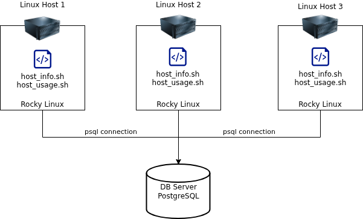

# Linux Cluster Monitoring Agent


## Introduction
This project provides an MVP solution for the Jarvis Linux Cluster Administration team, which manages a Rocky Linux cluster made up of ten interconnected nodes. The team needs a reliable way to collect each node's hardware specifications and monitor real-time resource usage such as CPU, memory, and disk space. To meet this requirement, the project implements a monitoring agent designed to collect system performance metrics from Linux hosts and store them inside a PostgreSQL database. By centralizing the data, the LCA team can run SQL queries to analyze node performance, track resource trends, and make informed decisions for future capacity planning.

This project uses Bash scripts, Docker, PostgreSQL, and cron to build a monitoring agent that records host information and collects usage metrics at regular intervals. It shows a demonstration of Linux scripting and RDBMS integration for generating resource insights across cluster nodes.


## Quick Start
#### 1. Start the PostgreSQL Docker instance
```
# Create the PostgreSQL container (run once)
./linux_sql/scripts/psql_docker.sh create db_username db_password

# Start the container
./scripts/psql_docker.sh start
```

#### 2. Create the database tables
```
# Execute the DDL file to create required tables
psql -h psql_host -U psql_user -d db_name -f sql/ddl.sql
```

#### 3. Insert hardware specifications
```
# Insert node hardware specifications into the host_info table
./linux_sql/scripts/host_info.sh psql_host psql_port db_name psql_user psql_password
```

#### 4. Insert hardware usage data
```
# Insert a snapshotof the nodes's resource usage usage into the host_usage table
./linux_sql/scripts/host_usage.sh psql_host psql_port db_name psql_user psql_password
```

#### 5. Set up Contrab job for automated monitoring
```
# Run to edit contrab jobs
crontab -e

# Enter following line to set up new job
* * * * * /bin/bash /path/to/host_usage.sh psql_host psql_port db_name psql_user psql_password > /tmp/host_usage.log
```

## Implementation

### Architecture


As the diagram shows, three Rocky Linux hosts run Bash monitoring agent scripts to collect hardware and usage data. Each host sends these metrics directly to a centralized PostgreSQL database, where all information is stored and analyzed in one place.


### Scripts
- **psql_docker.sh:** 
Handles the setup and lifecycle of the PostgreSQL Docker container. It lets you create, start, and stop the database environment used to store all monitoring data.
**Usage:**
    ```
    # Create the PostgreSQL container
    ./linux_sql/scripts/psql_docker.sh create db_username db_password

    # Start the container
    ./linux_sql/scripts/psql_docker.sh start

    # Stop the container
    ./linux_sql/scripts/psql_docker.sh stop
    ```


- **host_info.sh:**
Collects static hardware information from a Linux node, such as CPU details, memory size, and machine architecture. This script is run once per host to register its specifications in the database.
**Usage:**
    ```
    ./linux_sql/scripts/host_info.sh psql_host psql_port db_name psql_user psql_password
    ```

- **host_usage.sh:**
Captures real-time system metrics like free memory, CPU idle percentage, kernel usage, and available disk space. It is used to track how each node behaves over time.
**Usage:**
    ```
    ./linux_sql/scripts/host_usage.sh psql_host psql_port db_name psql_user psql_password
    ```

- **crontab:**
Automates the monitoring process by scheduling host_usage.sh to run every minute. This ensures that the database is continuously updated with fresh usage data.
**Usage:**
    ```
    # Open the crontab editor
    crontab -e

    # Add scheduled job
    * * * * * /bin/bash /path/to/host_usage.sh psql_host psql_port db_name psql_user psql_password > /tmp/host_usage.log

    # Verify job was succesfully created by listing contrab jobs
    contrab -ls

    # Verify script runs properly by checking log file
    cat /tmp/host_usage.log
    ```


### Database Modeling
#### `host_info`
Stores static hardware information for each node in the cluster. Each row represents one host and is inserted only once.

- `id`: Unique identifier for each host; primary key and auto-incremented by PostgreSQL
- `hostname`: Full hostname of the server used to identify each node
- `cpu_number`: Number of CPU cores available on the host
- `cpu_architecture`: CPU architecture type
- `cpu_model`: Full CPU model name reported by the system
- `cpu_mhz`: CPU clock speed in MHz
- `l2_cache`: Size of the L2 cache memory
- `total_mem`: Total amount of system memory in MB
- `timestamp`: UTC timestamp indicating when this hardware information was collected

#### `host_usage`
Stores real-time resource usage metrics collected at regular intervals (every minute). Each row represents one snapshot of system usage.
- `timestamp`: UTC time when the usage metrics were recorded for the host
- `host_id`: Foreign key referencing the corresponding host in the host_info table
- `memory_free`: Amount of free memory, in MB, at the moment of data collection 
- `cpu_idle`: Percentage of CPU time spent idle
- `cpu_kernel`: Percentage of CPU time spent in kernel mode
- `disk_io`: Number of disk I/O operations since boot
- `disk_available`: Available disk space, in MB, at the time of measurement


## Test
To test the Bash scripts and the database setup, I ran everything manually and checked the results directly in PostgreSQL. After running `host_info.sh`, I verified that one correct entry was added to the `host_info` table. I then executed `host_usage.sh` several times and confirmed that each run produced a new, accurate usage record in `host_usage`. 

I also tested the DDL by loading `ddl.sql` into PostgreSQL to make sure the tables and constraints were created without any issues. 

Finally, I tested the crontab job by scheduling `host_usage.sh` to run every minute and checked both `/tmp/host_usage.log` and the database to confirm that new usage entries were being inserted automatically. 

Overall, every component behaved as expected and the monitoring pipeline ran smoothly.


## Deployment
The project was deployed using GitHub, Docker, and crontab. The PostgreSQL database runs in a Docker container managed through the `psql_docker.sh` script, making it easy to start or stop the environment. All Bash scripts and SQL files were version-controlled and pushed to GitHub for easy access and collaboration. To automate the monitoring process, I set up a crontab job that runs `host_usage.sh` every minute, allowing the system to collect and store usage data continuously without any manual work.

## Improvements

**1. Add error handling and logging:** The monitoring scripts would benefit from more detailed error checks and structured logging to make troubleshooting easier.

**2. Handle hardware updates automatically:** Hardware information is only collected once. The system could be enhanced by detecting changes in CPU, memory, or disk configuration and updating the database accordingly.

**3.Create automated backup routines:** Adding a scheduled backup process for the PostgreSQL database would help protect monitoring data and ensure it can be restored in case of failures or accidental data loss.

